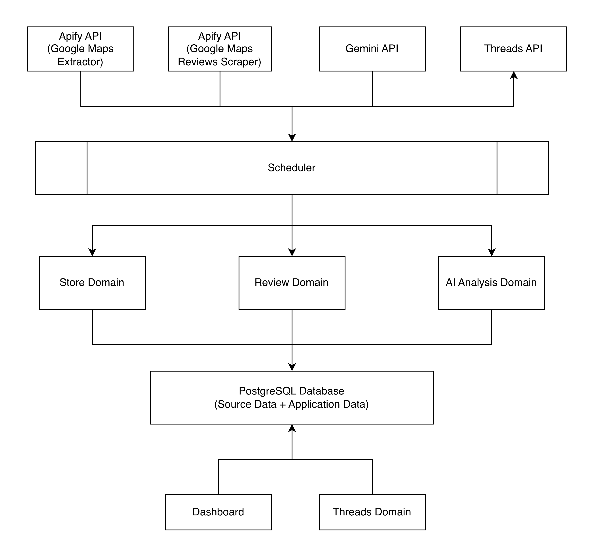
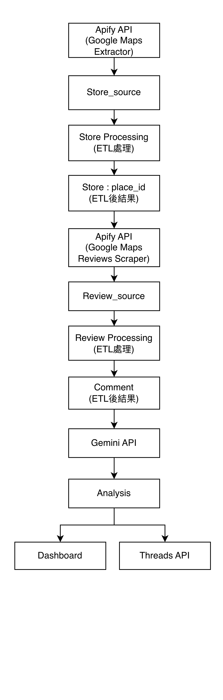
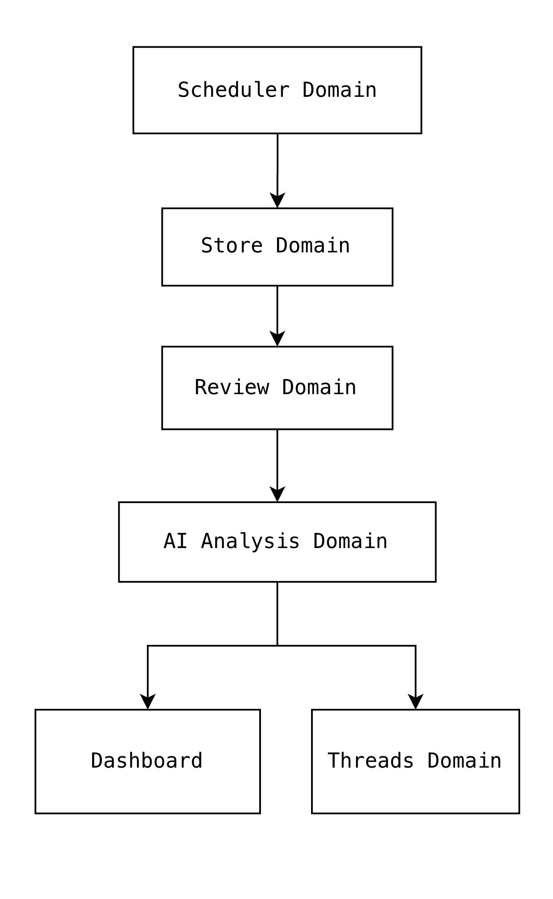
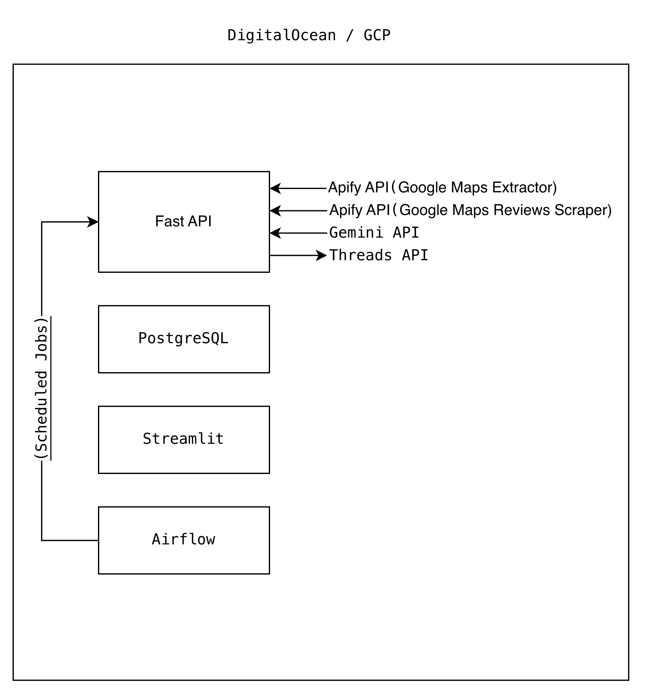

# Product Architecture
* **Version**：v1.0 
* **Date**：2026/6/29
* **Owner**：Allison

# 1. Purpose

本文件描述 DramaRadar 系統整體架構、各 Domain 職責、資料流向、業務流程與正式環境架構。

本文件作為後續 Domain Model、Database Design、Data Contract、API Contract 及 Sprint Planning 之設計依據。

# 2. Overall Architecture Diagram

## Figure 2-1 Overall Architecture

Note：描述 Service 間的依賴關係，並非實際呼叫流程。

# 3. Domain Responsibility

| Domain / Component           | Responsibility                                                                             |
| ---------------------------- | ------------------------------------------------------------------------------------------ |
| **Store Domain**             | 負責串接 Apify API（Google Maps Extractor）、店家資料蒐集、Raw JSON 儲存、ETL、店家資料更新，以及提供 Store API。        |
| **Review Domain**            | 負責串接 Apify API（Google Maps Reviews Scraper）、評論資料蒐集、Raw JSON 儲存、ETL、評論資料更新，以及提供 Review API。 |
| **AI Analysis Domain**       | 負責呼叫 Gemini API、評論分析、Drama 判斷、摘要、分類、分析結果儲存，以及提供 AI Analysis API。                           |
| **Threads Domain**           | 負責依 AI Analysis 結果產生 Threads 內容、發布至 Threads API，並保存發文紀錄。                                   |
| **Dashboard**                | 提供 Drama 排行榜、Drama Map、統計資訊、查詢與資料視覺化。                                                      |
| **Scheduler (Orchestrator)** | 依排程協調各 Domain 執行流程，控制整體 Pipeline，不負責任何 Business Logic。                                     |

# 4. Data Flow Diagram

## Figure 4-1 Data Flow

# 5. Business Workflow Diagram

## Figure 5-1 Daily Workflow

> **Note**
>
> 本圖描述 DramaRadar 每日執行流程與各 Service 之業務依賴關係。
>
> 本圖不描述程式實作方式，實際執行流程（例如 Airflow DAG、Task 拆分）將於後續工程設計文件定義。

# 6. Production Architecture

## Figure 6-1 Production Architecture

# 7. Business Decision Flow
> 缺 待補

# 8. Guide to Diagrams
| Diagram          | Purpose              |
| ----------------------- | -------------- |
| Overall Architecture    | 有哪些元件，描述系統主要元件與彼此關係。 |
| Data Flow               | 資料怎麼流，描述資料生命週期。      |
| Business Workflow       | 執行順序，描述每日業務流程。      |
| Production Architecture | 部署在哪，描述正式環境元件與互動方式。 |
|Business Decision Flow   |判斷條件，描述邏輯運算方式。|
