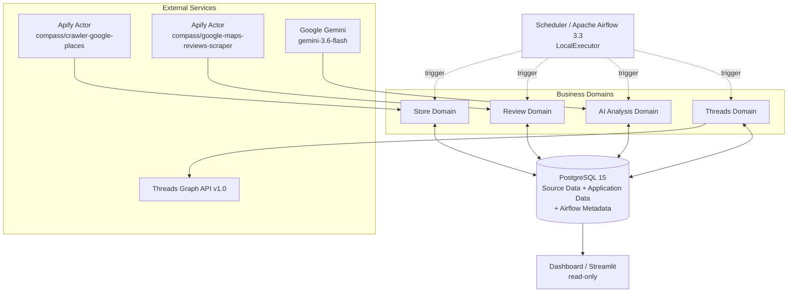
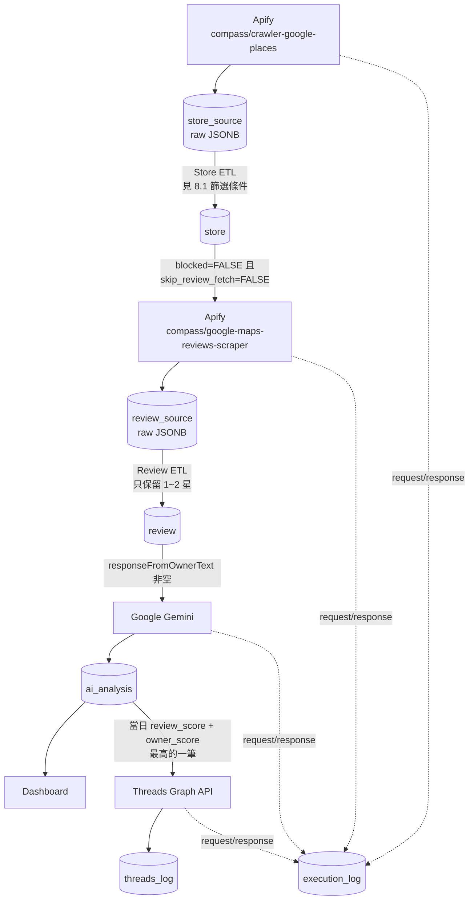
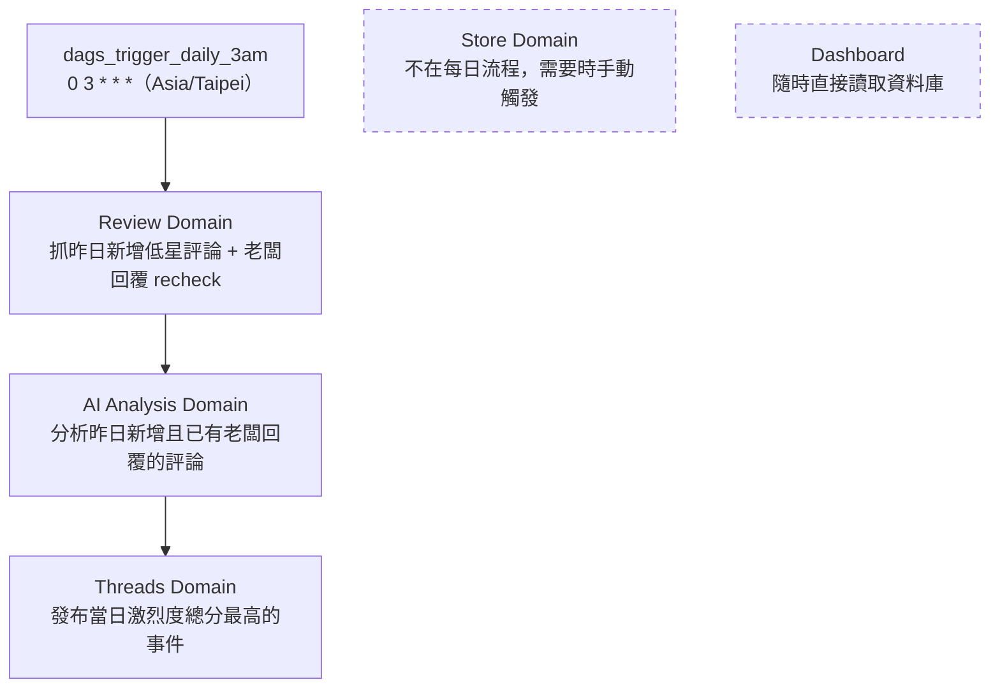
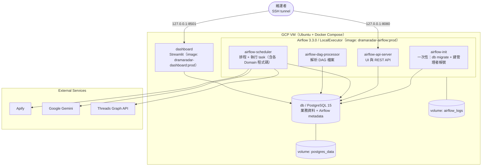

# Product Architecture
* **Version**：v1.2
* **Date**：2026/8/22
* **Owner**：Allison

> v1.1 更新：修正 Store Domain 使用的 Apify Actor 名稱、補上 [7. Scheduler Topology](#7-scheduler-topology) 排程拓撲，並填寫原本待補的 [8. Business Decision Flow](#8-business-decision-flow)。
>
> v1.2 更新：四張圖表全部改以 Mermaid 內嵌並修正錯誤 —— Production Architecture 原本畫有 `Fast API` 元件（專案並無 API 層）、Daily Workflow 原本包含 Store Domain（已移出每日排程）、Overall Architecture 原本未呈現 Scheduler 對 Threads Domain 的觸發關係。第 6 節另補上正式環境與開發環境的服務對照。

# 1. Purpose

本文件描述 DramaRadar 系統整體架構、各 Domain 職責、資料流向、業務流程與正式環境架構。

本文件作為後續 Domain Model、Database Design、Data Contract、API Contract 及 Sprint Planning 之設計依據。

# 2. Overall Architecture Diagram

## Figure 2-1 Overall Architecture


```mermaid
flowchart TB
    subgraph EXT["External Services"]
        AP1["Apify Actor<br/>compass/crawler-google-places"]
        AP2["Apify Actor<br/>compass/google-maps-reviews-scraper"]
        GEM["Google Gemini<br/>gemini-3.6-flash"]
        THA["Threads Graph API v1.0"]
    end

    SCH["Scheduler / Apache Airflow 3.3<br/>LocalExecutor"]

    subgraph DOM["Business Domains"]
        ST["Store Domain"]
        RV["Review Domain"]
        AI["AI Analysis Domain"]
        TH["Threads Domain"]
    end

    DB[("PostgreSQL 15<br/>Source Data + Application Data<br/>+ Airflow Metadata")]
    DASH["Dashboard / Streamlit<br/>read-only"]

    SCH -. trigger .-> ST
    SCH -. trigger .-> RV
    SCH -. trigger .-> AI
    SCH -. trigger .-> TH

    AP1 --> ST
    AP2 --> RV
    GEM --> AI
    TH --> THA

    ST <--> DB
    RV <--> DB
    AI <--> DB
    TH <--> DB
    DB --> DASH
```

Note：描述 Service 間的依賴關係，並非實際呼叫流程。各 Domain 之間**不直接互相呼叫**，一律透過 PostgreSQL 交換資料。Scheduler 對四個 Domain 皆有觸發關係，Threads Domain 同樣由排程驅動（`threads_dags_v1`），並非只被動讀取資料庫。

# 3. Domain Responsibility

| Domain / Component           | Responsibility                                                                             |
| ---------------------------- | ------------------------------------------------------------------------------------------ |
| **Store Domain**             | 負責串接 Apify Actor `compass/crawler-google-places`、店家資料蒐集、Raw JSON 儲存、ETL、店家資料更新。 |
| **Review Domain**            | 負責串接 Apify Actor `compass/google-maps-reviews-scraper`、評論資料蒐集、Raw JSON 儲存、ETL、評論資料更新、老闆回覆補抓。 |
| **AI Analysis Domain**       | 負責呼叫 Gemini API、評論分析、Drama 判斷、摘要、分類、分析結果儲存。                           |
| **Threads Domain**           | 負責依 AI Analysis 結果產生 Threads 內容、發布至 Threads Graph API，並保存發文紀錄。                                   |
| **Dashboard**                | 提供 Drama 排行榜、Drama Map、統計資訊、查詢與資料視覺化。**唯讀**，不寫入任何資料表。                                     |
| **Scheduler (Orchestrator)** | 依排程協調各 Domain 執行流程，控制整體 Pipeline，不負責任何 Business Logic。                                     |

## 3.1 Implementation Mapping

| Domain | 程式位置 | 外部服務 |
|---|---|---|
| Store | `domains/store/` | Apify `compass/crawler-google-places` |
| Review | `domains/review/` | Apify `compass/google-maps-reviews-scraper` |
| AI Analysis | `domains/ai_analysis/` | Google Gemini（`google-genai` SDK，model `gemini-3.6-flash`） |
| Threads | `domains/threads/` | Threads Graph API v1.0（`https://graph.threads.net/v1.0`） |
| Dashboard | `dashboard/` | — |
| Scheduler | `domains/dags.py` + 各 Domain 的 `dag.py` | Apache Airflow 3.3（LocalExecutor） |

各 Domain 內部檔案職責一致：`client.py` 只做外部連線、`etl.py` 只做資料轉換、`db_handler.py` / `repository.py` 收攏所有 SQL、`pipeline.py` / `service.py` 負責流程編排、`dag.py` 只描述排程與任務相依。

# 4. Data Flow Diagram

## Figure 4-1 Data Flow


```mermaid
flowchart TD
    AP1["Apify<br/>compass/crawler-google-places"]
    SS[("store_source<br/>raw JSONB")]
    ST[("store")]
    AP2["Apify<br/>compass/google-maps-reviews-scraper"]
    RS[("review_source<br/>raw JSONB")]
    RV[("review")]
    GEM["Google Gemini"]
    AI[("ai_analysis")]
    DASH["Dashboard"]
    THA["Threads Graph API"]
    TL[("threads_log")]
    EL[("execution_log")]

    AP1 --> SS
    SS -->|"Store ETL<br/>見 8.1 篩選條件"| ST
    ST -->|"blocked=FALSE 且<br/>skip_review_fetch=FALSE"| AP2
    AP2 --> RS
    RS -->|"Review ETL<br/>只保留 1~2 星"| RV
    RV -->|"responseFromOwnerText 非空"| GEM
    GEM --> AI
    AI --> DASH
    AI -->|"當日 review_score + owner_score<br/>最高的一筆"| THA
    THA --> TL

    AP1 -. request/response .-> EL
    AP2 -. request/response .-> EL
    GEM -. request/response .-> EL
    THA -. request/response .-> EL
```

> **Note**
>
> 遵循 Raw First 原則：外部 API 回傳的原始 JSON 一律先完整寫入 `*_source` 表，業務表全部由 ETL 產生且可重跑。
>
> 每個階段的請求參數、回應內容、處理筆數與錯誤訊息另外寫入 `execution_log`（虛線）。

# 5. Business Workflow Diagram

## Figure 5-1 Daily Workflow


```mermaid
flowchart TD
    CRON["dags_trigger_daily_3am<br/>0 3 * * *（Asia/Taipei）"]
    RV["Review Domain<br/>抓昨日新增低星評論 + 老闆回覆 recheck"]
    AI["AI Analysis Domain<br/>分析昨日新增且已有老闆回覆的評論"]
    TH["Threads Domain<br/>發布當日激烈度總分最高的事件"]
    ST["Store Domain<br/>不在每日流程，需要時手動觸發"]
    DASH["Dashboard<br/>隨時直接讀取資料庫"]

    CRON --> RV --> AI --> TH

    style ST stroke-dasharray: 5 5
    style DASH stroke-dasharray: 5 5
```

> **Note**
>
> 本圖描述 DramaRadar 每日執行流程與各 Service 之業務依賴關係。
>
> 虛線方塊不屬於每日排程。**Store Domain 已自每日流程移除**（理由見 7.3），Dashboard 為唯讀前端、不由排程驅動。
>
> 本圖不描述程式實作方式，實際 Airflow DAG 與 Task 拆分請見第 7 節。

# 6. Production Architecture

系統**沒有 API 層**。各 Domain 是被 Airflow 直接以 Python 函式呼叫的模組，不透過 HTTP 溝通；Dashboard 也是直接連 PostgreSQL 查詢，不經過後端服務。

## Figure 6-1 Production Architecture


```mermaid
flowchart TB
    subgraph VM["GCP VM（Ubuntu + Docker Compose）"]
        subgraph AF["Airflow 3.3.0 / LocalExecutor（image: dramaradar-airflow:prod）"]
            INIT["airflow-init<br/>一次性：db migrate + 建管理者帳號"]
            APISRV["airflow-api-server<br/>UI 與 REST API"]
            SCHED["airflow-scheduler<br/>排程 + 執行 task（含各 Domain 程式碼）"]
            DAGP["airflow-dag-processor<br/>解析 DAG 檔案"]
        end

        DASH["dashboard<br/>Streamlit（image: dramaradar-dashboard:prod）"]
        DB[("db / PostgreSQL 15<br/>業務資料 + Airflow metadata")]

        VOL1[("volume: postgres_data")]
        VOL2[("volume: airflow_logs")]
    end

    subgraph EXT["External Services"]
        APIFY["Apify"]
        GEM["Google Gemini"]
        THA["Threads Graph API"]
    end

    OP(["維運者<br/>SSH tunnel"])

    INIT --> DB
    APISRV --> DB
    SCHED --> DB
    DAGP --> DB
    DASH --> DB

    DB --- VOL1
    AF --- VOL2

    SCHED --> APIFY
    SCHED --> GEM
    SCHED --> THA

    OP -->|"127.0.0.1:8080"| APISRV
    OP -->|"127.0.0.1:8501"| DASH
```

正式環境以 `docker-compose.prod.yml` 啟動下列服務：

| 服務 | 說明 | Port |
|---|---|---|
| `db` | PostgreSQL 15，業務資料與 Airflow metadata 共用 | `127.0.0.1:5432` |
| `airflow-init` | 一次性初始化：`airflow db migrate` + 建立管理者帳號，跑完即結束 | — |
| `airflow-api-server` | Airflow UI 與 REST API | `127.0.0.1:8080` |
| `airflow-scheduler` | 排程器，**實際執行各 Domain 業務程式碼的地方**（LocalExecutor） | — |
| `airflow-dag-processor` | DAG 檔案解析程序 | — |
| `dashboard` | Streamlit 前端 | `127.0.0.1:8501` |

所有對外埠只綁 `127.0.0.1`，需透過 SSH tunnel 或反向代理存取。部署細節見 [`010-GCP VM Deployment.md`](<../05_Deployment/010-GCP VM Deployment.md>)。

## 6.1 與開發環境的差異

開發環境走 `docker-compose.yml`，服務組成大致相同，但有幾點關鍵差異：

| 項目 | 開發（`docker-compose.yml`） | 正式（`docker-compose.prod.yml`） |
|---|---|---|
| 程式碼 | bind mount 整個專案目錄 | build 階段烘進 image |
| `app` 服務 | 有，`sleep infinity` 供 VS Code Dev Container 附著 | 無 |
| Airflow UI 服務名 | `airflow-webserver`（`command: api-server`） | `airflow-api-server` |
| Dashboard | 手動下 `streamlit run` 啟動 | 由 compose 直接啟動 |
| Airflow logs | bind mount `./scheduler/logs` | 具名 volume `airflow_logs` |
| 對外埠 | `0.0.0.0` | 只綁 `127.0.0.1` |
| DAG 初始狀態 | 暫停 | 直接啟用 |

> 開發環境的服務名稱 `airflow-webserver` 是沿用 Airflow 2 的命名，實際下的指令已經是 Airflow 3 的 `api-server`。

## 6.2 資料庫與 DAG 目錄配置

Airflow 與業務資料**共用同一個 PostgreSQL 實例**（Airflow metadata 使用 `postgresql+psycopg2` 連線字串，業務資料使用 `DATABASE_URL`）。`domains/` 目錄掛載（正式環境為 COPY）為 Airflow 的 DAG 資料夾 `/opt/airflow/dags/domains`，因此 Domain 程式碼與 DAG 定義放在一起，不另設 `dags/` 目錄。

# 7. Scheduler Topology

**所有子 DAG 的 `schedule` 皆為 `None`**，排程集中由 `domains/dags.py` 的兩支總控 DAG 以 `TriggerDagRunOperator`（`wait_for_completion=True`）串接，確保前一階段完成才進入下一階段。

## 7.1 Daily Pipeline

```
dags_trigger_daily_3am        schedule = "0 3 * * *"（Asia/Taipei）
  └─ review_daily_dag_v2       抓昨日新增低星評論 + 老闆回覆 recheck
       └─ ai_analysis_daily_dag_v1   分析昨日新增且已有老闆回覆的評論
            └─ threads_dags_v1        發布當日最高分事件
```

## 7.2 Full Rebuild Pipeline

```
dags_trigger_all              schedule = None（手動觸發）
  └─ store_dag_v1              重新蒐集台北市店家
       └─ review_initial_dag_v2      全量抓取低星評論
            └─ ai_analysis_all_dag_v1     重跑全部 AI 分析
                 └─ threads_dags_v1
```

## 7.3 Design Rationale

* **Store 不納入每日排程。** 店家清單變動不頻繁，而 Apify 店家爬蟲成本相對高（每筆 place 約 $0.005 USD），因此改為需要時手動觸發。
* **集中排程。** 子 DAG 一律 `schedule=None`，避免同一支 DAG 同時被自身排程與上游 Trigger 啟動而重複執行。
* **同步等待。** `wait_for_completion=True` 保證資料相依順序：沒有評論就不會有 AI 分析，沒有 AI 分析就沒有可發布的內容。
* **Sensor 而非輪詢迴圈。** Apify Actor 執行時間不固定，Review DAG 以 Airflow Sensor 每 120 秒 poke 一次（逾時 30 分鐘），避免長時間佔用 worker。

# 8. Business Decision Flow

本節描述系統各階段的判斷條件。所有參數集中在各 Domain 的 `config.py`。

## 8.1 店家是否納入追蹤（Store ETL）

須**同時**滿足下列條件才寫入 `store`：

| 條件 | 規則 | 理由 |
|---|---|---|
| 樣本量 | `reviewsCount >= 30` | 評論太少不具代表性 |
| 爭議性 | `totalScore <= 4.3` **或** `oneStar / reviewsCount >= 0.1` | 分數低、或雖然平均分不差但一星佔比高（兩極化）者才有戲 |
| 營業狀態 | 非永久歇業且非暫時歇業 | 已歇業店家無追蹤價值 |

寫入後另以兩個旗標控制後續行為：

* `blocked`：預設 `FALSE`，保留給人工下架特定店家。
* `skip_review_fetch`：命中連鎖品牌黑名單（`domains/store/config.py` 的 `chains`，約 200 個品牌）時設為 `TRUE`，不再抓取其評論。

## 8.2 評論是否保留（Review ETL）

| 條件 | 規則 |
|---|---|
| 星等 | 僅 `stars` 為 1 或 2 的評論寫入 `review` |
| 原始資料 | 不論星等，Apify 回傳的原始 JSON 一律完整寫入 `review_source` |
| 去重 | 以 `reviewId` 去重，重複者覆寫 |

抓取策略依模式而異：

| 模式 | maxReviews | reviewsSort | 時間範圍 |
|---|---|---|---|
| Initial | `oneStar + twoStar + 50` | `lowestRanking` | 不限 |
| Daily | 依批次預設 | `newest` | `reviewsStartDate` = 昨天 |

## 8.3 老闆回覆補抓（Owner Reply Recheck）

老闆回覆通常不會與評論同時出現，因此需要回頭確認：

```
評論寫入時沒有老闆回覆
        │
        ▼
owner_reply_recheck = TRUE，next_check_at = 今天 + 2 天
        │
        ▼
到期後重抓 ──有回覆──▶ 更新 responseFromOwnerText，結束 recheck
        │
      無回覆
        │
        ▼
next_check_at += 2 天
        │
        ▼
距 publishedAtDate 超過 10 天 ──▶ 放棄，結束 recheck
```

## 8.4 制式公關回覆排除

老闆回覆若與制式公關話術範本相似度 `>= 80%`（以 `thefuzz` 計算），視為無交鋒價值：該筆不列入分析對象，且該店家的 `store.skip_review_fetch` 會被設為 `TRUE`，不再浪費額度抓取。

這是 Review Domain 唯一會寫入 `store` 表的例外情形。

## 8.5 是否進行 AI 分析

| 條件 | 規則 |
|---|---|
| 必要條件 | `responseFromOwnerText` 非空 — 只有顧客單方面抱怨不構成「吵架」 |
| Daily 模式 | 另加 `scrapedAt > 昨天`，只分析新資料 |
| All 模式 | 不限時間，重跑全部符合必要條件者 |
| 批次大小 | 每 50 則送一次 Gemini，避免單次 request 過大 |

AI 對顧客與老闆**各自**輸出：摘要（30 字內）、情緒標籤、1~10 分激烈度，並額外產生一則建議公關回覆。情緒標籤為固定五選一（理性客觀、高級反串、暴躁老哥、無聊公關、高情商幽默），以 Pydantic schema 強制約束輸出格式。

## 8.6 發文事件挑選

| 步驟 | 規則 |
|---|---|
| 候選範圍 | `review.scrapedAt >= 昨日午夜（UTC）` 且已有 AI 分析 |
| 排序 | `review_score + owner_score` 由高至低 |
| 選取 | 取第 1 筆 |
| 無候選時 | 發布「今日不 Drama」替代貼文，維持每日更新節奏 |

發文前會自動刷新 Threads 長期存取權杖並寫回 `.env`；刷新失敗則不發文。

# 9. Guide to Diagrams

所有圖表皆以 Mermaid 內嵌於本文件，不再使用外部圖片檔，改程式時可與程式碼一起 diff 與 review。

| Diagram | 位置 | Purpose |
| --- | --- | --- |
| Overall Architecture | Figure 2-1 | 有哪些元件，描述系統主要元件與彼此關係。 |
| Data Flow | Figure 4-1 | 資料怎麼流，描述資料生命週期。 |
| Business Workflow | Figure 5-1 | 執行順序，描述每日業務流程。 |
| Production Architecture | Figure 6-1 | 部署在哪，描述正式環境元件與互動方式。 |
| Scheduler Topology | 第 7 節 | DAG 之間的觸發關係。 |
| Business Decision Flow | 第 8 節 | 判斷條件，以表格與流程文字表述。 |
