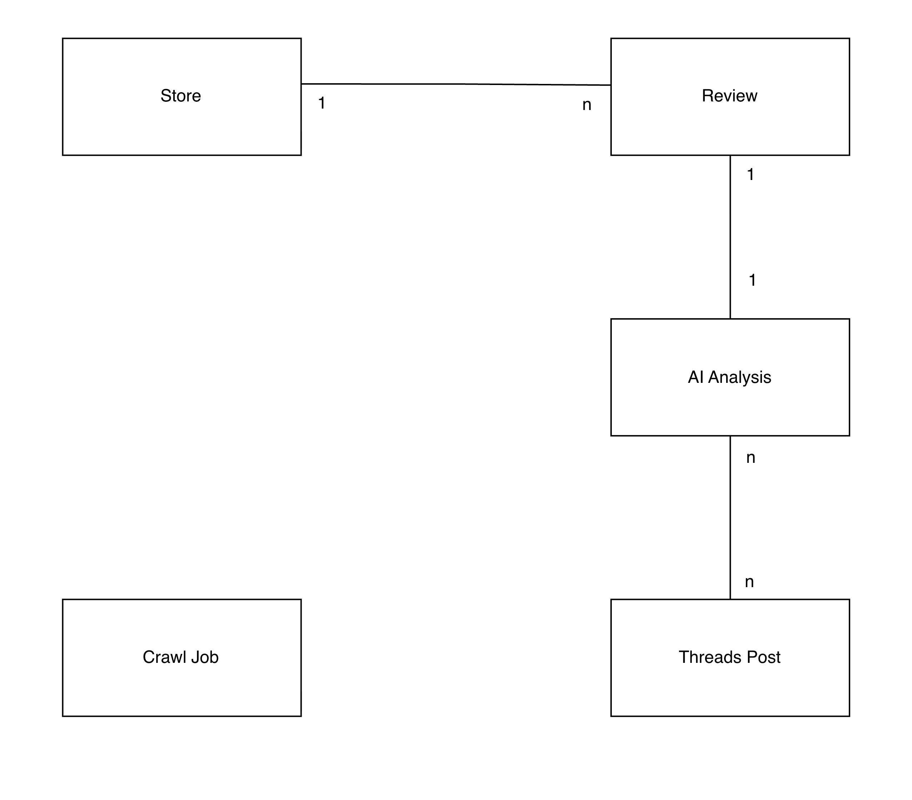

# DOC-003 Domain Model
* **Version**：v1.0 
* **Date**：2026/6/29
* **Owner**：Allison
---

# 1. Purpose

定義 DramaRadar 的核心業務實體及其關聯。

採用 UML Domain Model描述系統概念模型，不包含資料庫欄位、資料型別、API 或實作細節。

作為後續 Database Design（DOC-004）、Data Contract（DOC-005）及 API Contract（DOC-006）之設計依據。

# 2. Domain Model

## Figure 2-1 Domain Model

# 3. Entity Definition

## Store

代表從 Apify API（Google Maps Extractor）取得的店家資料，是 DramaRadar 所有評論的歸屬對象。

## Review

代表一則屬於 Store 的 Google 評論，作為 AI Analysis 的分析對象。

## AI Analysis

代表 AI 對單一 Review 所產生的分析結果，包含 Drama 判斷、摘要及相關分析資訊。

## Threads Post

代表根據 AI Analysis 自動產生並發布至 Threads 的貼文。

## Crawl Job

代表一次由排程系統建立的爬蟲工作，負責觸發店家資料、評論資料及 AI 分析流程。

# 4. Design Rules

* 一個 Store 可包含多筆 Review。
* 每一筆 Review 必須屬於一個 Store。
* 每一筆 Review 必須對應一筆 AI Analysis。
* 一筆 AI Analysis 可產生零或一筆 Threads Post。
* Crawl Job 為獨立業務實體，不直接擁有其他 Domain Entity。
* **Domain Model 僅描述業務實體及其關聯**，不包含資料庫設計、資料處理流程、API 或程式實作細節。
* Domain Entity 應保持與 Business Concept 一致，不得以資料表、API 或程式實作命名。
