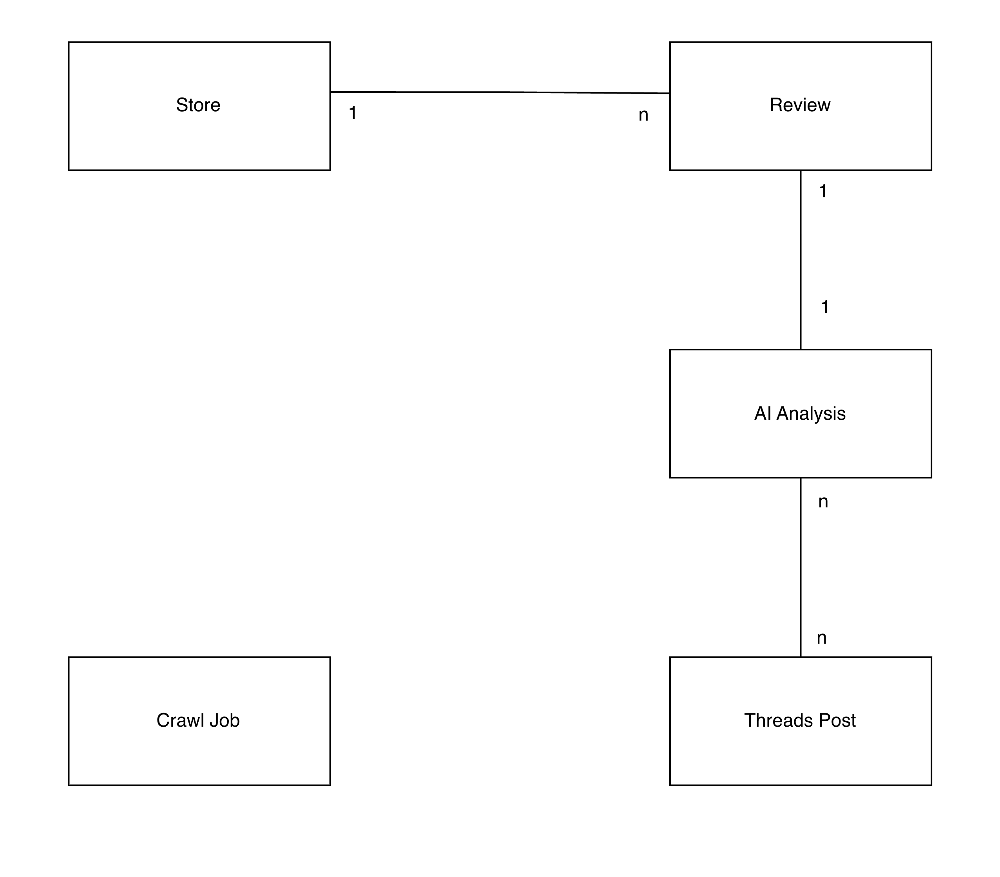

# DOC-003 Domain Model
* **Version**：v1.1
* **Date**：2026/8/22
* **Owner**：Allison
---

> v1.1 更新：修正 Review 與 AI Analysis 的關聯基數（實作上只有「已有老闆回覆」的 Review 才會產生分析）、補上 Review 僅涵蓋低星評論的說明，並將 Crawl Job 對齊實作中的 Execution Log。

# 1. Purpose

定義 DramaRadar 的核心業務實體及其關聯。

採用 UML Domain Model 描述系統概念模型，不包含資料庫欄位、資料型別、API 或實作細節。

作為後續 Database Design（DOC-004）、Data Contract（DOC-005）及 API Contract（DOC-006）之設計依據。

# 2. Domain Model

## Figure 2-1 Domain Model

> 圖中的 Crawl Job 對應實作中的 Execution Log，見第 3 節說明。

# 3. Entity Definition

## Store

代表從 Apify（Google Maps 店家爬蟲）取得的店家資料，是 DramaRadar 所有評論的歸屬對象。

系統只收錄**具備爭議性**的店家：評論數達門檻、且評分偏低或一星佔比偏高、且仍在營業。連鎖品牌雖然可能被收錄，但會被標記為不抓取評論。

## Review

代表一則屬於 Store 的 Google 評論，作為 AI Analysis 的分析對象。

系統只收錄 **1~2 星的低星評論**。高星評論不屬於本系統的業務範圍。

Review 具有「老闆是否已回覆」的狀態。由於老闆回覆通常晚於評論出現，Review 會被反覆確認直到取得回覆或超過追蹤期限。

## AI Analysis

代表 AI 對單一 Review 所產生的分析結果，包含對顧客與老闆**雙方各自**的情緒判斷、摘要、激烈程度評分，以及一則建議公關回覆。

只有**已取得老闆回覆**的 Review 才會產生 AI Analysis — 單方面的抱怨不構成可分析的衝突。

## Threads Post

代表根據 AI Analysis 自動產生並發布至 Threads 的貼文。

每日最多產生一則，取當日激烈程度總分最高的事件。若當日無合格事件，仍會發布一則替代貼文。

## Execution Log

代表一次 Pipeline 執行的紀錄，涵蓋店家蒐集、評論蒐集、AI 分析與 Threads 發文各階段，保存請求參數、回應內容、處理筆數與錯誤訊息。

原始設計中稱為 Crawl Job（僅涵蓋爬蟲），實作時擴大為涵蓋所有 Pipeline 的執行紀錄，因此更名為 Execution Log。

# 4. Design Rules

* 一個 Store 可包含零或多筆 Review。
* 每一筆 Review 必須屬於一個 Store。
* 一筆 Review 可對應零或一筆 AI Analysis；僅當該 Review 已有老闆回覆時才會產生。
* 一筆 AI Analysis 必須對應一筆 Review。
* 一筆 AI Analysis 可產生零或一筆 Threads Post。
* Execution Log 為獨立業務實體，不直接擁有其他 Domain Entity。
* **Domain Model 僅描述業務實體及其關聯**，不包含資料庫設計、資料處理流程、API 或程式實作細節。
* Domain Entity 應保持與 Business Concept 一致，不得以資料表、API 或程式實作命名。

## 4.1 Multiplicity Summary

| 關聯 | 基數 |
|---|---|
| Store → Review | `1 : 0..*` |
| Review → AI Analysis | `1 : 0..1` |
| AI Analysis → Threads Post | `1 : 0..1` |
| Execution Log | 獨立，無關聯 |
