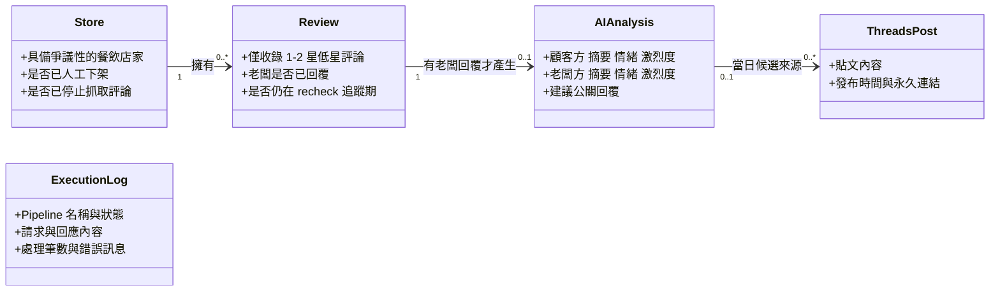

# DOC-003 Domain Model
* **Version**：v1.2
* **Date**：2026/8/22
* **Owner**：Allison
---

> v1.1 更新：修正 Review 與 AI Analysis 的關聯基數（實作上只有「已有老闆回覆」的 Review 才會產生分析）、補上 Review 僅涵蓋低星評論的說明，並將 Crawl Job 對齊實作中的 Execution Log。
>
> v1.2 更新：Figure 2-1 改以 Mermaid 內嵌並修正錯誤 —— 原圖的實體名稱仍是 Crawl Job、Review 與 AI Analysis 標為 `1:1`、AI Analysis 與 Threads Post 標為 `n:n`，均與第 4 節的設計規則不符。

# 1. Purpose

定義 DramaRadar 的核心業務實體及其關聯。

採用 UML Domain Model 描述系統概念模型，不包含資料庫欄位、資料型別、API 或實作細節。

作為後續 Database Design（DOC-004）、Data Contract（DOC-005）及 API Contract（DOC-006）之設計依據。

# 2. Domain Model

## Figure 2-1 Domain Model

```mermaid
classDiagram
    direction LR

    class Store {
        +具備爭議性的餐飲店家
        +是否已人工下架
        +是否已停止抓取評論
    }
    class Review {
        +僅收錄 1-2 星低星評論
        +老闆是否已回覆
        +是否仍在 recheck 追蹤期
    }
    class AIAnalysis {
        +顧客方 摘要 情緒 激烈度
        +老闆方 摘要 情緒 激烈度
        +建議公關回覆
    }
    class ThreadsPost {
        +貼文內容
        +發布時間與永久連結
    }
    class ExecutionLog {
        +Pipeline 名稱與狀態
        +請求與回應內容
        +處理筆數與錯誤訊息
    }

    Store "1" --> "0..*" Review : 擁有
    Review "1" --> "0..1" AIAnalysis : 有老闆回覆才產生
    AIAnalysis "0..1" --> "0..*" ThreadsPost : 當日候選來源
```

`ExecutionLog` 為獨立實體，不參照其他 Entity，因此圖上沒有連線。

# 3. Entity Definition

## Store

代表從 Apify（Google Maps 店家爬蟲）取得的店家資料，是 DramaRadar 所有評論的歸屬對象。

系統只收錄**具備爭議性**的店家：評論數達門檻、且評分偏低或一星佔比偏高、且仍在營業。連鎖品牌雖然可能被收錄，但會被標記為不抓取評論。

## Review

代表一則屬於 Store 的 Google 評論，作為 AI Analysis 的分析對象。

系統只收錄 **1~2 星的低星評論**。高星評論不屬於本系統的業務範圍。

Review 具有「老闆是否已回覆」的狀態。由於老闆回覆通常晚於評論出現，Review 會被反覆確認直到取得回覆或超過追蹤期限。

## AI Analysis

代表 AI 對單一 Review 所產生的分析結果，包含對顧客與老闆**雙方各自**的情緒判斷、摘要、激烈程度評分，以及一則建議公關回覆。

只有**已取得老闆回覆**的 Review 才會產生 AI Analysis — 單方面的抱怨不構成可分析的衝突。

## Threads Post

代表根據 AI Analysis 自動產生並發布至 Threads 的貼文。

每日排程最多產生一則，取當日激烈程度總分最高的事件。若當日無合格事件，仍會發布一則不對應 AI Analysis 的替代貼文。手動重跑 DAG 可能再次發布同一候選，因此單一 AI Analysis 在概念上可成為多筆貼文的來源。

目前 `threads_log` 沒有保存 `reviewId` 或 `analysisId`，所以這個關係只存在於執行流程，資料庫中無法直接追溯。

## Execution Log

代表一次 Pipeline 執行的紀錄，涵蓋店家蒐集、評論蒐集、AI 分析與 Threads 發文各階段，保存請求參數、回應內容、處理筆數與錯誤訊息。

原始設計中稱為 Crawl Job（僅涵蓋爬蟲），實作時擴大為涵蓋所有 Pipeline 的執行紀錄，因此更名為 Execution Log。

# 4. Design Rules

* 一個 Store 可包含零或多筆 Review。
* 每一筆 Review 必須屬於一個 Store。
* 一筆 Review 可對應零或一筆 AI Analysis；僅當該 Review 已有老闆回覆時才會產生。
* 一筆 AI Analysis 必須對應一筆 Review。
* 一筆 Threads Post 對應零或一筆 AI Analysis；替代貼文不對應分析。
* 一筆 AI Analysis 可成為零或多筆 Threads Post 的來源（例如手動重跑發文 DAG）。
* Execution Log 為獨立業務實體，不直接擁有其他 Domain Entity。
* **Domain Model 僅描述業務實體及其關聯**，不包含資料庫設計、資料處理流程、API 或程式實作細節。
* Domain Entity 應保持與 Business Concept 一致，不得以資料表、API 或程式實作命名。

## 4.1 Multiplicity Summary

| 關聯 | 基數 |
|---|---|
| Store → Review | `1 : 0..*` |
| Review → AI Analysis | `1 : 0..1` |
| AI Analysis → Threads Post | `0..1 : 0..*`（流程關聯，未保存外鍵） |
| Execution Log | 獨立，無關聯 |
