# DramaRadar 完整架構圖集

- **版本**：v1.0
- **日期**：2026-08-22
- **依據**：目前程式碼、DAG、SQLAlchemy models 與 `docker-compose.prod.yml`

本文件集中放置簡報、開發與維運所需的完整圖表。圖中的資料關聯是**邏輯關聯**；目前 SQLAlchemy models 沒有宣告 `ForeignKey`，實體資料庫只有 Primary Key 約束。

## 圖表索引

1. 系統情境圖
2. 容器／服務架構圖
3. Domain 元件圖
4. 端到端資料流
5. Airflow DAG 拓撲
6. Store Domain 流程
7. Review Domain 流程
8. Owner Reply Recheck 狀態圖
9. Apify 付費資料救援流程
10. AI Analysis 流程與斷點續跑
11. Threads 發文序列圖
12. GCP 正式環境部署圖
13. Domain Model
14. 實體資料庫 ERD

---

## 1. 系統情境圖

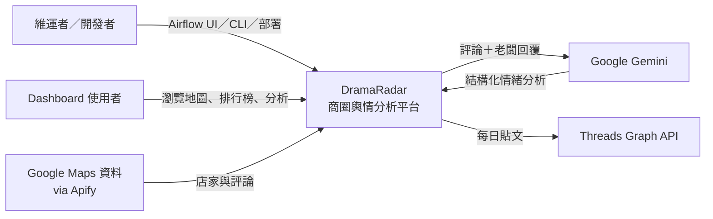

## 2. 容器／服務架構圖

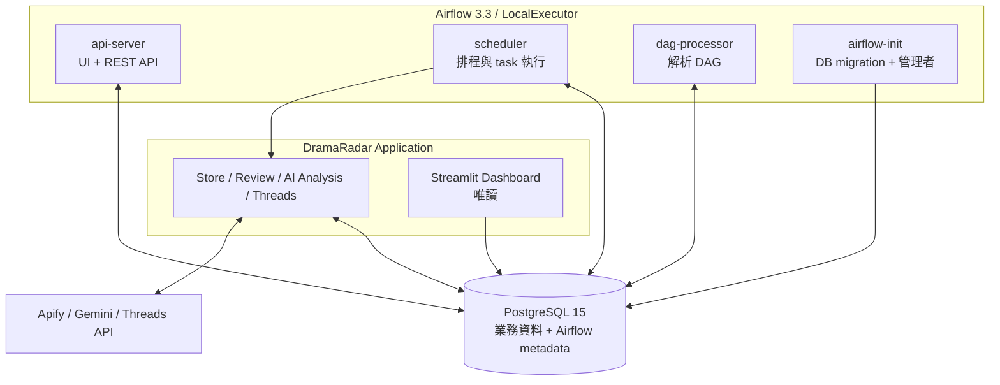

> 專案沒有 FastAPI 或獨立 backend API。Airflow 直接執行 Python Domain 模組；Dashboard 直接讀 PostgreSQL。

## 3. Domain 元件圖

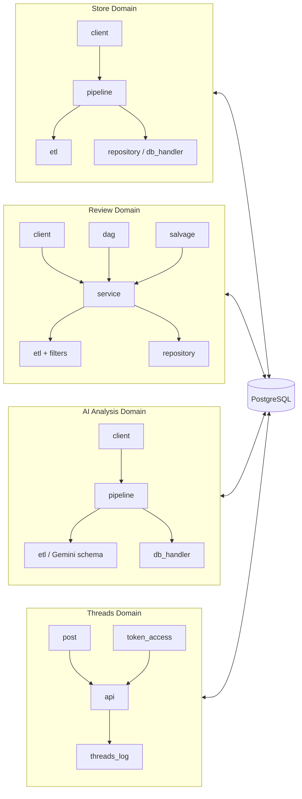

## 4. 端到端資料流

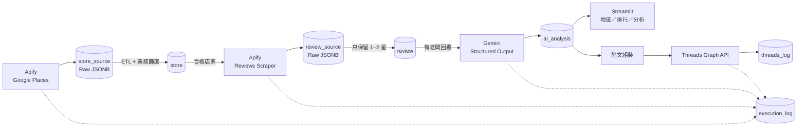

## 5. Airflow DAG 拓撲

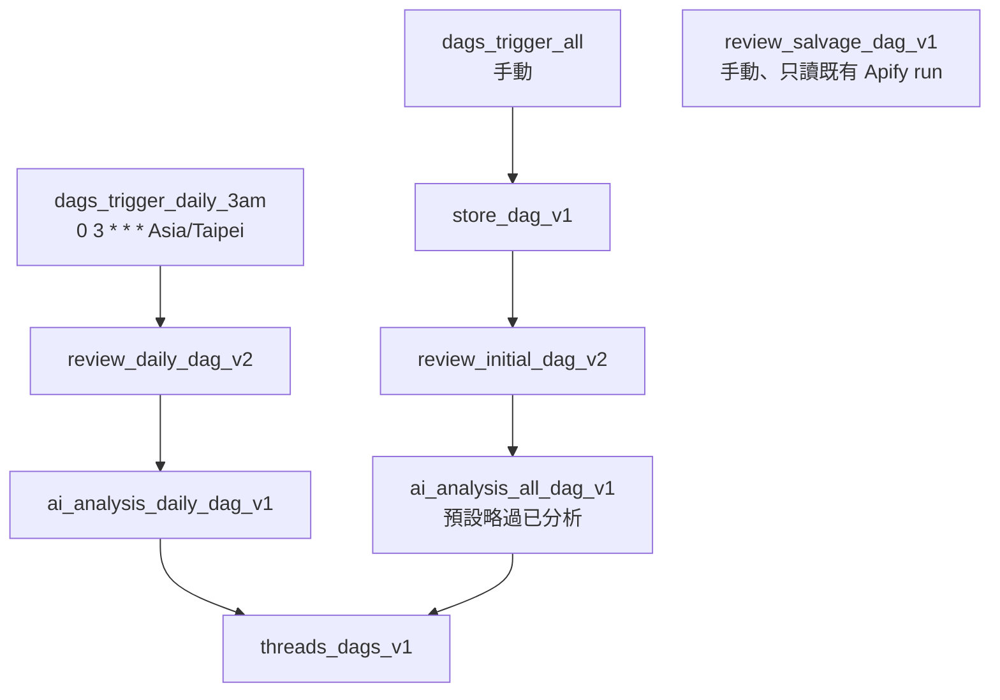

> 所有子 DAG 的 `schedule=None`。總控 DAG 使用 `TriggerDagRunOperator(wait_for_completion=True)` 保證階段順序。

## 6. Store Domain 流程

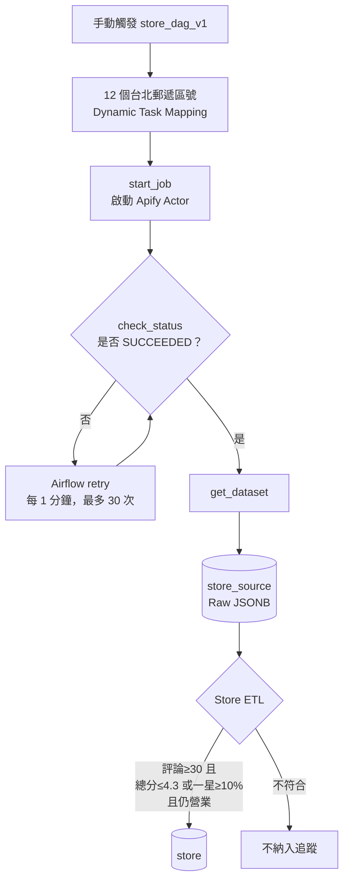

## 7. Review Domain 流程

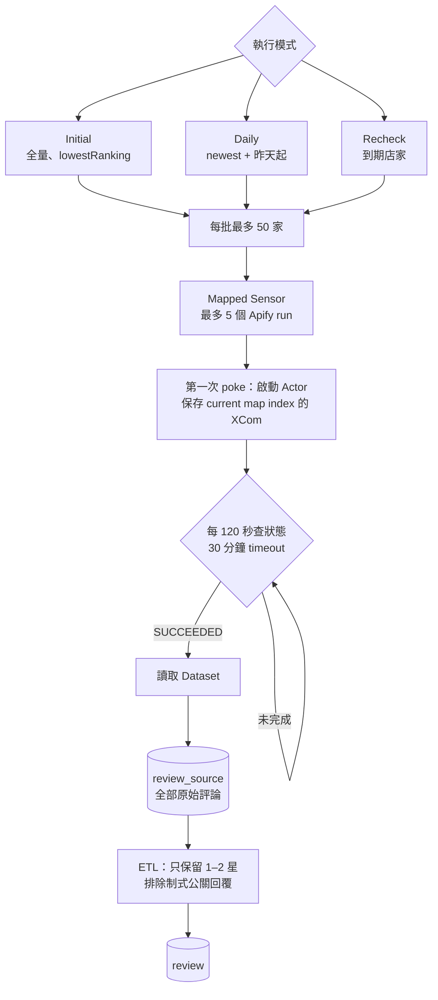

## 8. Owner Reply Recheck 狀態圖

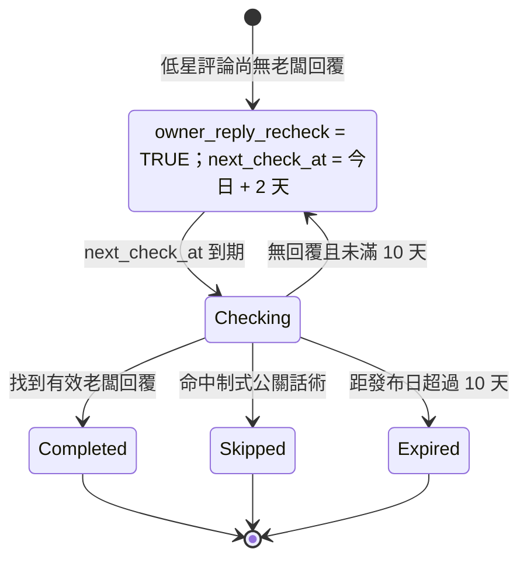

## 9. Apify 付費資料救援流程

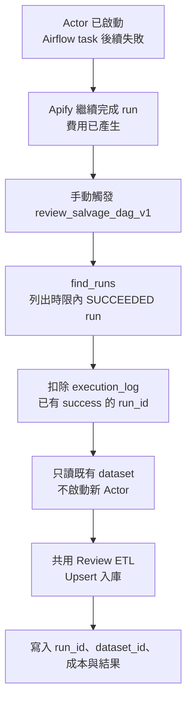

> Apify dataset 約保留 7 天。救援流程查狀態與讀 dataset，不會再啟動付費爬取。

## 10. AI Analysis 流程與斷點續跑

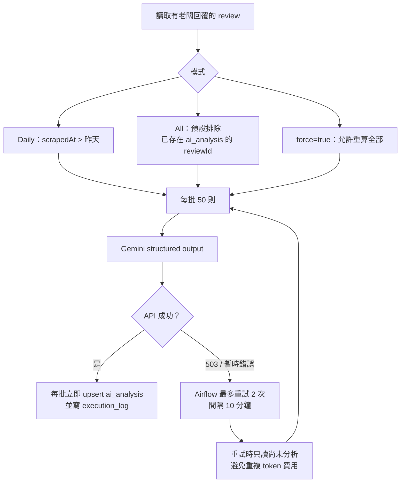

## 11. Threads 發文序列圖

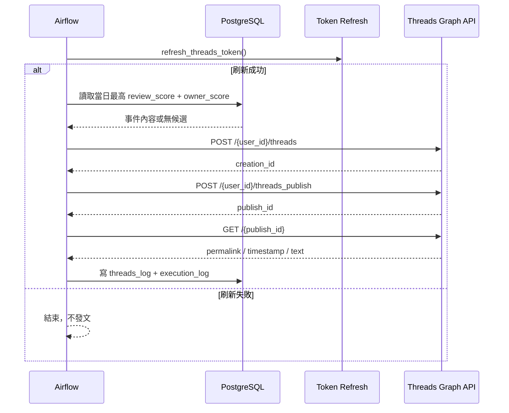

## 12. GCP 正式環境部署圖

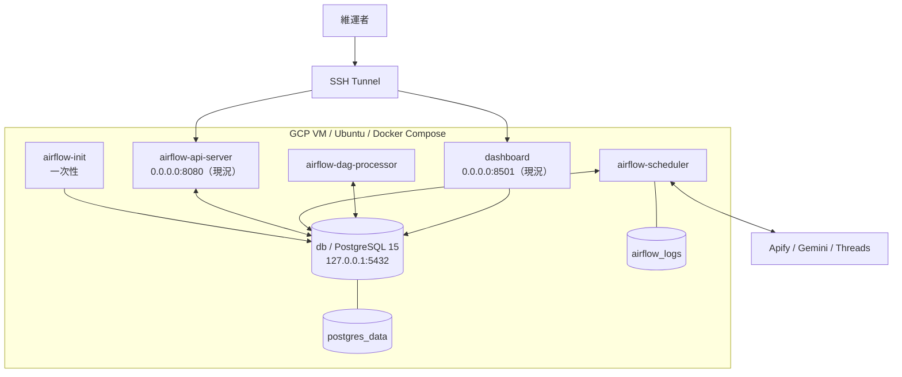

> 正式環境的程式碼在 build 階段 COPY 進 image，不使用專案 bind mount；更新程式後必須重新 build。現行 compose 只有 PostgreSQL 綁 `127.0.0.1`，Airflow UI 與 Dashboard 綁所有網卡；GCP 防火牆不可開放 8080／8501 公網 ingress，維運應走 SSH tunnel。若要在容器層硬化，port mapping 應改成 `127.0.0.1:8080:8080` 與 `127.0.0.1:8501:8501`。

## 13. Domain Model

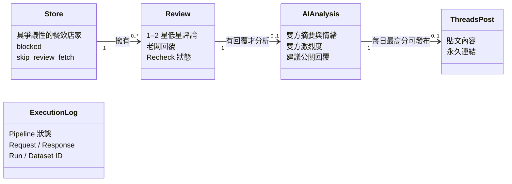

`ExecutionLog` 是獨立的跨 Pipeline 紀錄，不直接參照業務實體。

## 14. 實體資料庫 ERD

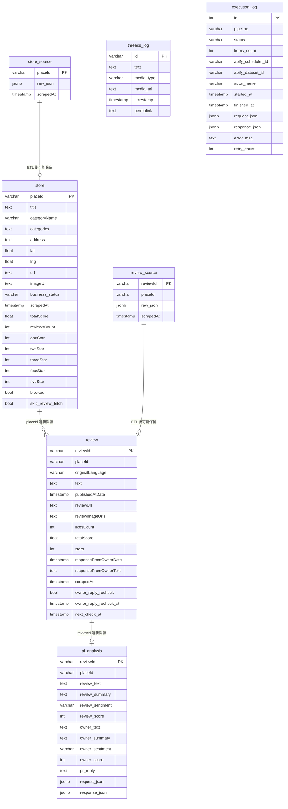

### ERD 注意事項

- `store_source → store`、`review_source → review` 是「Raw 經 ETL 後可能產生 Business row」，不是必然一對一。
- `threads_log` 沒有 `reviewId` 或 `analysisId`；它只保存 Threads API 回傳的貼文資料，所以與 `ai_analysis` 無法在資料庫層直接 join。
- `execution_log` 不與業務表建立關係。
- models 未宣告 Foreign Key、Secondary Index 或 migration；目前參照完整性依賴 ETL 順序與 Upsert。
