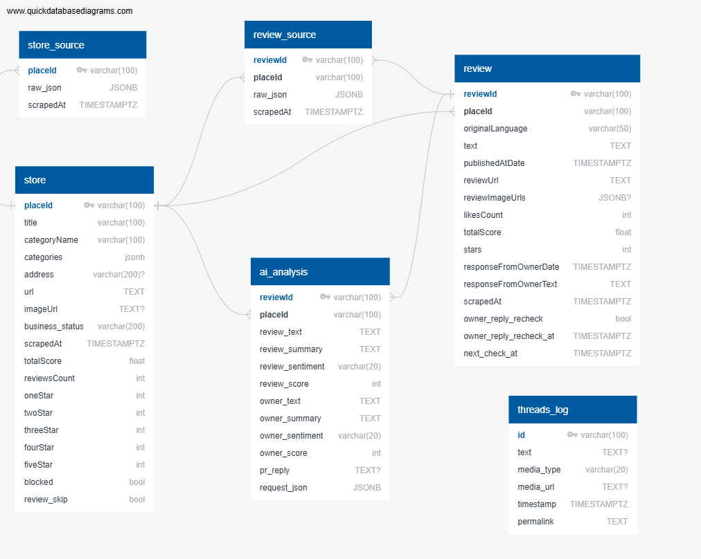

# 004-Database Design
- **Version**：v1.0
- **Date**：2026/07/07
- **Author**：Allison
---

# 1. Purpose

定義 DramaRadar 之資料庫架構、資料表設計、資料關聯及命名規範。

所有 Domain（Store、Review、AI Analysis、Threads）皆依據設計資料儲存方式，以確保資料一致性、可維護性及後續擴充能力。

本文件同時作為 ETL Pipeline、Scheduler、Dashboard 及 AI Pipeline 之資料設計依據。

# 2. Database Design Principles

## 2.1 Database Platform

* Schema 欄位依照API名稱取，其他欄位依照Snake Case方法取名

| Item | Value |
|------|------|
| Database | PostgreSQL |
| Schema | public |
| Character Encoding | UTF-8 |
| Time Zone | UTC |
| JSON Format | JSONB |

## 2.2 Raw Data Principle

Store、Review External API 回傳資料皆須完整保存於 Raw Table。

Raw Table 為系統唯一 Source of Truth。

所有 Business Table 必須經由 ETL Pipeline 產生。

```
External API

↓

Raw Table (JSONB)

↓

ETL Pipeline

↓

Business Table
```

## 2.3 ETL Principle

- Raw Data 不直接提供系統查詢。
- Raw Data 不進行人工修改。
- Business Table 必須由 ETL Pipeline 建立。
- ETL Pipeline 必須支援重新執行（Reprocessing）。

## 2.4 External Identifier Principle

所有 External API Identifier 皆保留原始 Key。

例如：

- placeId
- reviewId

不得重新產生新的 Business Identifier。

## 2.5 Domain Ownership

每個 Domain 僅能維護自己的資料表。

其他 Domain 可讀取，但不得修改。

| Domain | Tables |
|---------|--------|
| Store | store_source、store |
| Review | review_source、review |
| AI Analysis | ai_analysis |
| Threads | threads_log |
| System | crawl_log |

## 2.6 Naming Convention

- Raw Table：`*_source`
- Log Table：`*_log`
- Raw API 欄位保留 External API 命名方式。
- 自行新增欄位採 snake_case。

# 3. Table Classification

| Table | Type | Source | Description |
|-------|------|--------|-------------|
| store_source | Raw | Apify Store API | Store API 原始 JSON |
| store | Business | Store ETL | 店家正式資料 |
| review_source | Raw | Apify Review API | Review API 原始 JSON |
| review | Business | Review ETL | 評論正式資料 |
| ai_analysis | Business | Gemini AI | AI 分析結果 |
| threads_log | Business | Threads API | Threads 發文紀錄 |
| crawl_log | Metadata | Scheduler | Pipeline 執行紀錄 |

# 4. Entity Relationship Diagram (ERD)


# 5. Index Strategy

建立 Index 原則如下：

- Primary Key
- Foreign Key
- Dashboard 常用查詢欄位
- Scheduler 常用查詢欄位

預計建立：

| Table | Index |
|--------|-------|
| store | placeId |
| review | reviewId |
| review | placeId |
| ai_analysis | reviewId |
| threads_log | timestamp |
| crawl_log | pipeline_name |

---

# 6. Constraints

所有 Business Table 必須遵守：

- Primary Key 不可為 NULL。
- Foreign Key 必須維持 Referential Integrity。
- placeId、reviewId 保留 External API Identifier。
- Raw Table 不允許直接修改 JSON。
- 所有 Timestamp 使用 UTC。