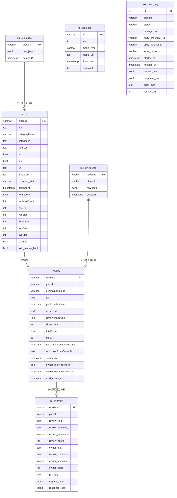

# 004-Database Design
- **Version**：v1.2
- **Date**：2026/8/22
- **Author**：Allison
---

> v1.1 更新：Domain Ownership 的 `crawl_log` 更正為實作中的 `execution_log`、補上完整資料表欄位清單、並將 Index 與 Constraint 章節改為記錄**實際建置狀況**（目前僅有 Primary Key）。
>
> v1.2 更新：ERD 改以 Mermaid 內嵌並依 `models.py` 校正 —— 原圖缺少 `store.lat` / `store.lng` 與 `execution_log.apify_dataset_id`，`execution_log.id` 誤標為 `varchar`（實際為自增整數）、`start_at` 應為 `started_at`，`categories` 與 `reviewImageUrls` 誤標為 JSONB（實際為 TEXT），時間欄位誤標為 TIMESTAMPTZ。

# 1. Purpose

定義 DramaRadar 之資料庫架構、資料表設計、資料關聯及命名規範。

所有 Domain（Store、Review、AI Analysis、Threads）皆依據設計資料儲存方式，以確保資料一致性、可維護性及後續擴充能力。

本文件同時作為 ETL Pipeline、Scheduler、Dashboard 及 AI Pipeline 之資料設計依據。

# 2. Database Design Principles

## 2.1 Database Platform

* Schema 欄位依照 API 名稱取，其他欄位依照 Snake Case 方法取名

| Item | Value |
|------|------|
| Database | PostgreSQL 15 |
| Schema | public |
| Character Encoding | UTF-8 |
| Time Zone | UTC |
| JSON Format | JSONB |

## 2.2 Raw Data Principle

Store、Review External API 回傳資料皆須完整保存於 Raw Table。

Raw Table 為系統唯一 Source of Truth。

所有 Business Table 必須經由 ETL Pipeline 產生。

```
External API

↓

Raw Table (JSONB)

↓

ETL Pipeline

↓

Business Table
```

## 2.3 ETL Principle

- Raw Data 不直接提供系統查詢。
- Raw Data 不進行人工修改。
- Business Table 必須由 ETL Pipeline 建立。
- ETL Pipeline 必須支援重新執行（Reprocessing）。

實作上所有寫入皆為 `INSERT ... ON CONFLICT DO UPDATE`（Upsert），以主鍵為衝突判定依據，因此 Pipeline 可重複執行而不產生重複資料。

## 2.4 External Identifier Principle

所有 External API Identifier 皆保留原始 Key。

例如：

- placeId
- reviewId

不得重新產生新的 Business Identifier。

## 2.5 Domain Ownership

每個 Domain 僅能維護自己的資料表。

其他 Domain 可讀取，但不得修改。

| Domain | Tables |
|---------|--------|
| Store | store_source、store |
| Review | review_source、review |
| AI Analysis | ai_analysis |
| Threads | threads_log |
| System | execution_log（各 Domain 皆寫入自己的執行紀錄） |

### 例外

Review Domain 會回寫 `store.skip_review_fetch`：當偵測到某店家的老闆回覆為制式公關話術時，需標記該店家不再抓取評論。這是目前唯一跨 Domain 寫入的情形。

### 實際存取矩陣

| Table | Store | Review | AI Analysis | Threads | Dashboard |
|---|:-:|:-:|:-:|:-:|:-:|
| `store` | 讀寫 | 讀 + 寫 `skip_review_fetch` | — | — | 讀 |
| `store_source` | 寫 | — | — | — | — |
| `review_source` | — | 寫 | — | — | — |
| `review` | — | 讀寫 | 讀 | 讀 | 讀 |
| `ai_analysis` | — | — | 寫 | 讀 | 讀 |
| `threads_log` | — | — | — | 寫 | — |
| `execution_log` | 寫 | 寫 | 寫 | 寫 | — |

## 2.6 Naming Convention

- Raw Table：`*_source`
- Log Table：`*_log`
- Raw API 欄位保留 External API 命名方式（camelCase，需以雙引號存取）。
- 自行新增欄位採 snake_case。

# 3. Table Classification

| Table | Type | Source | Description |
|-------|------|--------|-------------|
| store_source | Raw | Apify Store API | Store API 原始 JSON |
| store | Business | Store ETL | 店家正式資料 |
| review_source | Raw | Apify Review API | Review API 原始 JSON |
| review | Business | Review ETL | 評論正式資料 |
| ai_analysis | Business | Gemini AI | AI 分析結果 |
| threads_log | Business | Threads API | Threads 發文紀錄 |
| execution_log | Metadata | Scheduler | Pipeline 執行紀錄 |

# 4. Entity Relationship Diagram (ERD)


```mermaid
erDiagram
    store_source ||--o| store : "ETL 後可能保留"
    store ||--o{ review : "placeId"
    review_source ||--o| review : "ETL 後可能保留"
    review ||--o| ai_analysis : "有老闆回覆才分析"

    store_source {
        varchar placeId PK
        jsonb raw_json
        timestamp scrapedAt
    }
    store {
        varchar placeId PK
        text title
        varchar categoryName
        text categories
        text address
        float lat
        float lng
        text url
        text imageUrl
        varchar business_status
        timestamp scrapedAt
        float totalScore
        int reviewsCount
        int oneStar
        int twoStar
        int threeStar
        int fourStar
        int fiveStar
        bool blocked
        bool skip_review_fetch
    }
    review_source {
        varchar reviewId PK
        varchar placeId
        jsonb raw_json
        timestamp scrapedAt
    }
    review {
        varchar reviewId PK
        varchar placeId
        varchar originalLanguage
        text text
        timestamp publishedAtDate
        text reviewUrl
        text reviewImageUrls
        int likesCount
        float totalScore
        int stars
        timestamp responseFromOwnerDate
        text responseFromOwnerText
        timestamp scrapedAt
        bool owner_reply_recheck
        timestamp owner_reply_recheck_at
        timestamp next_check_at
    }
    ai_analysis {
        varchar reviewId PK
        varchar placeId
        text review_text
        text review_summary
        varchar review_sentiment
        int review_score
        text owner_text
        text owner_summary
        varchar owner_sentiment
        int owner_score
        text pr_reply
        jsonb request_json
        jsonb response_json
    }
    threads_log {
        varchar id PK
        text text
        varchar media_type
        text media_url
        timestamp timestamp
        text permalink
    }
    execution_log {
        int id PK
        varchar pipeline
        varchar status
        int items_count
        varchar apify_scheduler_id
        varchar apify_dataset_id
        varchar actor_name
        timestamp started_at
        timestamp finished_at
        jsonb request_json
        jsonb response_json
        text error_msg
        int retry_count
    }
```

> **Note**
>
> 圖中的關聯線描述**邏輯上**的參照關係。資料庫中並未建立實際的外鍵約束，原因見第 7 節。
>
> `execution_log` 不與任何業務資料表關聯，是所有 Pipeline 共用的執行紀錄表。
>
> `threads_log` 雖由 `ai_analysis` 的當日最高分候選產生，但表內沒有 `reviewId` 或 `analysisId`，因此 ERD 不畫直接關聯。若未來需要稽核貼文來源，應新增來源識別欄位。
>
> Raw row 經篩選後不一定會進 Business table，因此 `store_source → store` 與 `review_source → review` 都是 `1 → 0..1`，不是必然一對一。
>
> 型別以 `models.py` 實際建出的結果為準。時間欄位均為 `TIMESTAMP WITHOUT TIME ZONE`，與 `db/schema.sql` 宣告的 `TIMESTAMPTZ` 不一致，詳見第 7 節。

# 5. Table Definition

完整 DDL 見 [`db/schema.sql`](../../db/schema.sql)；SQLAlchemy 定義見各 Domain 的 `models.py`。

## 5.1 store

| Column | Type | Null | Description |
|---|---|:-:|---|
| `placeId` | VARCHAR(100) PK | ✖ | Google Place ID |
| `title` | TEXT | ✖ | 店名 |
| `categoryName` | VARCHAR(100) | ✖ | 主分類 |
| `categories` | TEXT | ✖ | 全部分類，以逗號串接 |
| `address` | TEXT | ✔ | 地址，Dashboard 以此過濾台北市 |
| `lat` / `lng` | FLOAT | ✖ | 座標，地圖標記用 |
| `url` | TEXT | ✖ | Google Maps 連結 |
| `imageUrl` | TEXT | ✔ | 店家縮圖 |
| `business_status` | VARCHAR(200) | ✖ | `OPEN` / `CLOSED`，由 ETL 依歇業旗標判定 |
| `scrapedAt` | TIMESTAMP | ✖ | 抓取時間 |
| `totalScore` | FLOAT | ✖ | Google 平均評分 |
| `reviewsCount` | INT | ✖ | 評論總數 |
| `oneStar`～`fiveStar` | INT | ✖ | 星等分布 |
| `blocked` | BOOL | ✖ | 人工下架旗標，預設 `FALSE` |
| `skip_review_fetch` | BOOL | ✖ | 不抓取評論（連鎖店或制式公關回覆） |

## 5.2 review

| Column | Type | Null | Description |
|---|---|:-:|---|
| `reviewId` | VARCHAR(100) PK | ✖ | Google Review ID |
| `placeId` | VARCHAR(100) | ✖ | 所屬店家 |
| `originalLanguage` | VARCHAR(50) | ✖ | 原始語言 |
| `text` | TEXT | ✖ | 評論內容 |
| `publishedAtDate` | TIMESTAMP | ✖ | 發布時間，recheck 期限的計算基準 |
| `reviewUrl` | TEXT | ✖ | 評論原始連結 |
| `reviewImageUrls` | TEXT | ✔ | 評論附圖 |
| `likesCount` | INT | ✖ | 按讚數 |
| `totalScore` | FLOAT | ✖ | 店家當時平均分 |
| `stars` | INT | ✖ | 本則星等，僅保留 1 或 2 |
| `responseFromOwnerDate` | TIMESTAMP | ✔ | 老闆回覆時間 |
| `responseFromOwnerText` | TEXT | ✔ | 老闆回覆內容，AI 分析的必要條件 |
| `scrapedAt` | TIMESTAMP | ✖ | 抓取時間，Daily 增量的判斷依據 |
| `owner_reply_recheck` | BOOL | ✖ | 是否仍需回頭確認老闆回覆 |
| `owner_reply_recheck_at` | TIMESTAMP | ✔ | 最後一次 recheck 時間 |
| `next_check_at` | TIMESTAMP | ✔ | 下次 recheck 時間 |

## 5.3 ai_analysis

| Column | Type | Null | Description |
|---|---|:-:|---|
| `reviewId` | VARCHAR(100) PK | ✖ | 對應評論 |
| `placeId` | VARCHAR(100) | ✖ | 所屬店家 |
| `review_text` | TEXT | ✖ | 清洗後顧客原文（外文另附繁中翻譯） |
| `review_summary` | TEXT | ✖ | 顧客發言摘要（30 字內） |
| `review_sentiment` | VARCHAR(20) | ✖ | 顧客情緒標籤（五選一） |
| `review_score` | INT | ✖ | 顧客激烈程度 1~10 |
| `owner_text` | TEXT | ✖ | 清洗後老闆原文 |
| `owner_summary` | TEXT | ✖ | 老闆回覆摘要（30 字內） |
| `owner_sentiment` | VARCHAR(20) | ✖ | 老闆情緒標籤（五選一） |
| `owner_score` | INT | ✖ | 老闆激烈程度 1~10 |
| `pr_reply` | TEXT | ✔ | AI 建議的最優公關回覆 |
| `request_json` | JSONB | ✖ | 送出的 prompt 內容 |
| `response_json` | JSONB | ✔ | Gemini 原始回應 |

情緒標籤固定為五種：理性客觀、高級反串、暴躁老哥、無聊公關、高情商幽默。

## 5.4 threads_log

| Column | Type | Null | Description |
|---|---|:-:|---|
| `id` | VARCHAR(100) PK | ✖ | Threads 貼文 ID |
| `text` | TEXT | ✔ | 貼文內容 |
| `media_type` | VARCHAR(20) | ✖ | 媒體類型 |
| `media_url` | TEXT | ✔ | 媒體連結 |
| `timestamp` | TIMESTAMP | ✖ | 發文時間 |
| `permalink` | TEXT | ✖ | 貼文永久連結 |

## 5.5 execution_log

| Column | Type | Null | Description |
|---|---|:-:|---|
| `id` | SERIAL PK | ✖ | 流水號 |
| `pipeline` | VARCHAR(200) | ✖ | `store` / `review_initial` / `review_daily` / `review_owner_recheck` / `review_manual` / `ai_analysis` / `threads` |
| `status` | VARCHAR(20) | ✖ | 執行狀態 |
| `items_count` | INT | ✖ | 處理筆數 |
| `apify_scheduler_id` | VARCHAR(20) | ✔ | Apify run id |
| `apify_dataset_id` | VARCHAR(20) | ✔ | Apify dataset id |
| `actor_name` | VARCHAR(100) | ✔ | 執行者標記 |
| `started_at` / `finished_at` | TIMESTAMP | ✖ / ✔ | 起訖時間 |
| `request_json` / `response_json` | JSONB | ✔ | 請求與回應內容 |
| `error_msg` | TEXT | ✔ | 錯誤訊息（AI 另存 token 用量） |
| `retry_count` | INT | ✖ | 重試次數 |

## 5.6 Raw Tables

`store_source` 與 `review_source` 結構一致：主鍵（`placeId` / `reviewId`）、`raw_json`（JSONB）、`scrapedAt`。`review_source` 另有 `placeId` 欄位。

# 6. Index Strategy

## 6.1 設計目標

建立 Index 原則如下：

- Primary Key
- Foreign Key
- Dashboard 常用查詢欄位
- Scheduler 常用查詢欄位

規劃中的索引：

| Table | Index |
|--------|-------|
| store | placeId |
| review | reviewId |
| review | placeId |
| ai_analysis | reviewId |
| threads_log | timestamp |
| execution_log | pipeline_name |

## 6.2 實際狀況

**目前資料庫中只有 Primary Key 索引。**

資料表由各 `db_handler.py` 匯入時呼叫 SQLAlchemy 的 `metadata.create_all()` 建立，而 `domains/*/models.py` 與 `db/shared_tables.py` 的欄位定義中**沒有宣告任何 `Index` 或 `ForeignKey`**，因此上表規劃的次要索引尚未建立。

`db/schema.sql` 雖然包含外鍵約束，但**不會被程式自動執行**，僅作為 DDL 參考。

以目前 MVP 的資料量（台北市餐飲店家）尚不構成效能問題。若後續擴大地區範圍，應優先補上 `review.placeId` 與 `ai_analysis.placeId` 的索引，因為 Dashboard 的排行榜與地圖查詢皆以店家聚合。

# 7. Constraints

## 7.1 設計目標

所有 Business Table 必須遵守：

- Primary Key 不可為 NULL。
- Foreign Key 必須維持 Referential Integrity。
- placeId、reviewId 保留 External API Identifier。
- Raw Table 不允許直接修改 JSON。
- 所有 Timestamp 使用 UTC。

## 7.2 實際狀況

| 約束 | 狀態 | 說明 |
|---|---|---|
| Primary Key | 已建立 | 各表主鍵皆定義於 `models.py` |
| Foreign Key | **未建立** | `schema.sql` 有定義但未執行；`models.py` 未宣告 `ForeignKey`。參照完整性目前由 ETL 流程順序保證（先寫 store 才寫 review） |
| Timestamp 時區 | **不一致** | `schema.sql` 宣告 `TIMESTAMPTZ`，但 `models.py` 使用未帶時區的 `TIMESTAMP`，實際建出的欄位為 `TIMESTAMP WITHOUT TIME ZONE` |

## 7.3 Schema 變更方式

專案**未導入 Alembic 或任何 migration 工具**。`metadata.create_all()` 只會建立不存在的資料表，**不會**變更既有資料表的結構。

因此修改 `models.py` 的欄位後，必須擇一處理：

1. 手動執行 `ALTER TABLE`，並同步更新 `db/schema.sql`；或
2. 開發環境下重建資料表（`domains/review/run_pipeline.py --mode clear-store` 可清空業務資料表）。
